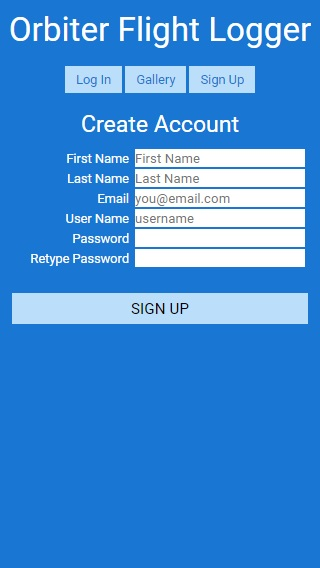
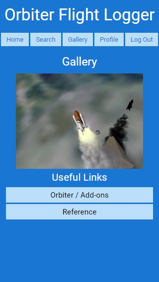
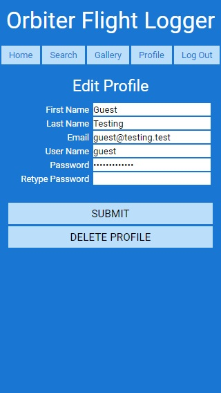

# [Orbiter Flight Logger](https://orbiter-flight-logger.herokuapp.com/)

An online tool for users of [Orbiter Space Flight Simulator](http://orbit.medphys.ucl.ac.uk/) to create and share flight logs.

## Summary


## Screenshots

### Signup Page



### Login Page


### Home Page


### Search Page


### Gallery Page



### Profile Page



## Built With

* HTML, CSS, JavaScript

* NPM, Express

* MongoDB, Mongoose, Passport, Chai, Faker

* Continuous Integration - Travis

* Deployed on Heroku

## Example User for Testing
```
User: guest
Password: passwordguest
```

## Link to Orbiter Flight Logger
- [Orbiter Flight Logger](https://orbiter-flight-logger.herokuapp.com/)

## Acknowledgements
Laura Morinigo

