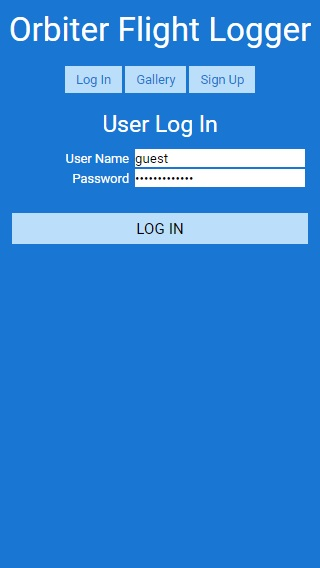
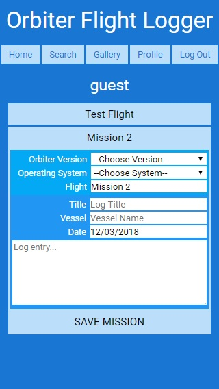

# [Orbiter Flight Logger](https://orbiter-flight-logger.herokuapp.com/)

An online tool for users of [Orbiter Space Flight Simulator](http://orbit.medphys.ucl.ac.uk/) to create and share flight logs.

## Summary


## Screenshots

### Signup / Login Pages

 

### Home Page / Search Page

 

### Gallery Page / Profile Page

 

## Built With

* NPM

* HTML, CSS, JavaScript

* Express, Mongoose, Passport

* Continuous Integration using Travis CI

* Deployed on Heroku using mLab for the database

## Example User for Testing
```
User: guest
Password: passwordguest
```

## Link to Orbiter Flight Logger
- [Orbiter Flight Logger](https://orbiter-flight-logger.herokuapp.com/)

## Acknowledgements
Laura Morinigo
